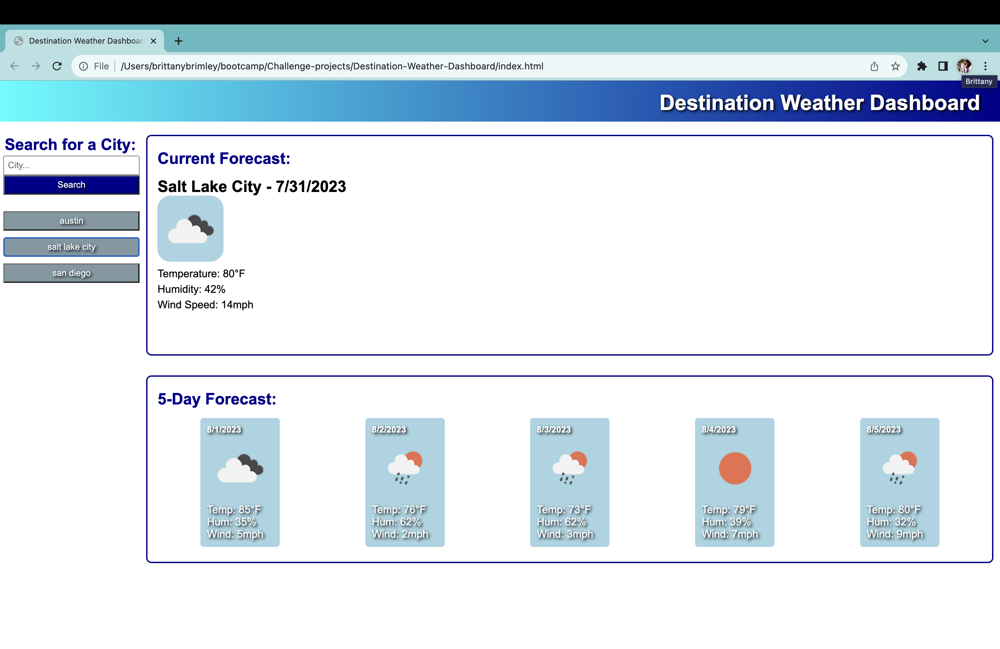

# Destination-Weather-Dashboard

## Links
[GitHub Repo](https://github.com/Git-BritHub/Destination-Weather-Dashboard.git)
 
[Live URL](https://git-brithub.github.io/Destination-Weather-Dashboard/)

## Description
This weather dashboard will assist users in their travels by allowing them to easily look up the weather for their desired city or cities. To further help the user as they search desired travel locations, a 5-day weather forecast for their city of interest will be displayed as well. When viewing current or 5-day weather forecasts of desired cities, the user will be able to easily access weather conditions as they are presented with the city's temperature, humidity and wind speed.

## Usage

## Credits
Sought guidance and feedback from the U of U's software developer tutors.